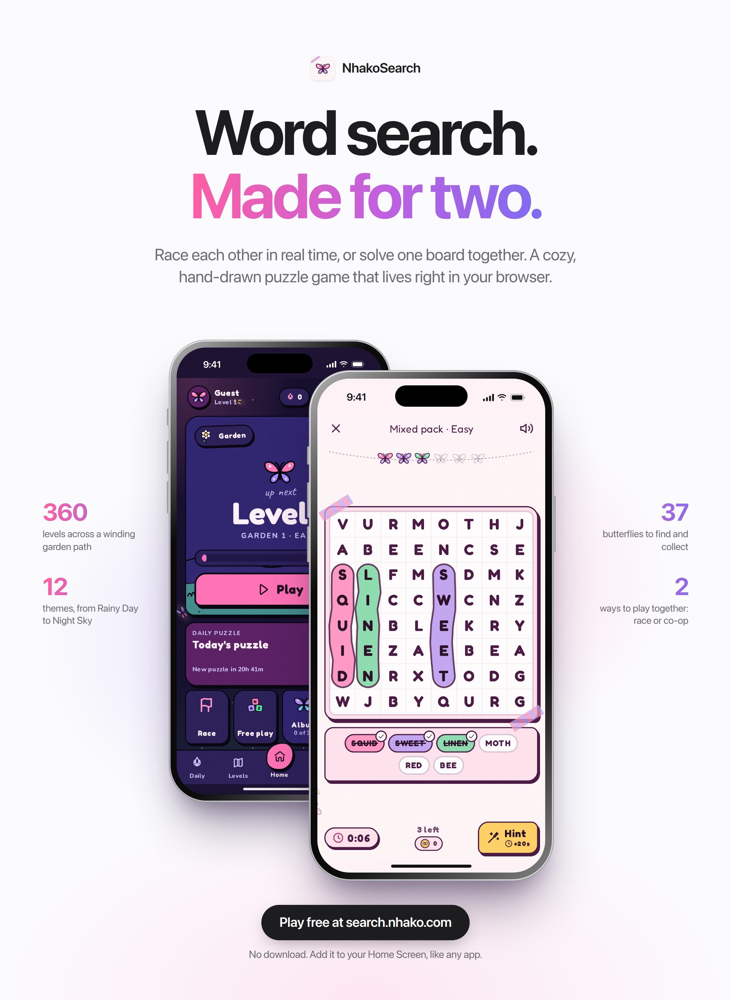

# NhakoSearch

**Word search. Made for two.**

A cozy, hand-drawn word-search game for two. Solo puzzles in twelve themes, a
daily challenge, a 360-level path, a butterfly album of 37 achievements,
friends with a leaderboard, and realtime multiplayer: race your partner, or
solve one board together while you chat.

Play free at **[search.nhako.com](https://search.nhako.com)**: no download,
and it installs to your Home Screen like any app.

<p align="center">
  
</p>

---

## Features

- **Free play**: 12 themes (Garden, Rainy Day, Night Sky, Bakery…) × easy /
  medium / hard, with a fresh-word picker so boards don't repeat.
- **Daily puzzle**: one shared board per day, with streaks.
- **Level path**: 360 levels across themed chapters, up to three stars each.
- **Multiplayer**: race a friend on the same board in real time, or solve it
  together in co-op, with in-room chat.
- **Butterfly album**: 37 achievements, each a hand-designed species.
- **Friends**: add by code, live requests, and a friend leaderboard.
- **Butterfly tokens**: earned by playing, spent on hints.
- **Procedural ambience**: rain, storm, wind, birds and four lofi tracks,
  all synthesised in the browser.
- **Light and dark**: "Meadow Journal" by day, "Night Garden" by night.
- **Installable PWA**: works as a Home Screen app on iOS and Android.

---

## Stack

| Layer | Choice | Notes |
|---|---|---|
| Framework | Next.js 16 (App Router), React 19, TypeScript | |
| Styling | Tailwind CSS v4 | CSS-variable theming, light/dark independent of system |
| Animation | Framer Motion | |
| Backend | Supabase | Postgres + RLS, Google OAuth, Realtime channels, RPCs |
| Audio | Web Audio API | Fully synthesised at runtime: no audio files shipped |
| Testing | Playwright | layout, a11y, race + chat, audio, rewards, security, performance |
| Hosting | Vercel | |

Everything runs on free tiers.

---

## Getting started

```bash
npm install
cp .env.example .env.local   # fill in your Supabase project values
npm run dev
```

Apply the database schema in the Supabase SQL editor, in order:

1. `supabase_schema.sql`: tables and row-level security for a fresh project
2. `supabase/migrations/002_security.sql` … `006_friend_live.sql`

005 adds token wallets, friendships, friend codes, the friend leaderboard and
the one-call `get_player_summary()` RPC. Without it, signed-in players see no
tokens, no friends page and slower screens. 006 pushes friend requests and
accepts live over a private Realtime topic per player (`user:<id>`), so the
badges and toasts update without a refresh.

| Command | Purpose |
|---|---|
| `npm run dev` | Development server |
| `npm run build` / `npm start` | Production build / serve it |
| `npm run lint` | ESLint |
| `npx playwright test` | Full test suite (expects the app on :3002) |

Security headers come from `next.config.ts` and behave differently under
`next dev`. Verify CSP against `npm run build && npm start`.

To reach the dev server from another machine (LAN or Tailscale IP), add the
host to `DEV_ORIGINS` in `.env.local`, e.g. `DEV_ORIGINS=192.168.1.20`.

---

## Project layout

```
app/                     Routes (App Router) + error / not-found / loading
  daily/  level-path/    Daily challenge, level map and level play
  play/standard/         Free play: 12 themes x 3 difficulties
  play/race/             Multiplayer lobby and room (with chat)
  album/  friends/       Butterfly album, friends + leaderboard
  profile/  settings/    You, sound mixer, account
components/
  game/  multiplayer/  nav/  sound/  ui/
  butterfly/Species.tsx  Draws any butterfly species from its recipe
  rewards/TokenPill.tsx  The token balance HUD
lib/
  auth/session.ts        The signed-in user, read once for the whole app
  data/cache.ts          Stale-while-revalidate cache (persisted)
  data/player.ts         The player summary every lobby screen reads
  rewards/               Tokens, hints economy, achievements, species, journal
  social/friends.ts      Friend codes, requests, leaderboard
  words/                 Theme word lists, fresh-word picker
  audio/                 Procedural ambience + sound effects
  puzzle/  levels/  daily/  multiplayer/
docs/                    Design spec (design.md) and game-feel notes
  launch/                Launch poster and its HTML source
supabase/migrations/     SQL migrations
tests/                   Playwright suites
```

---

## How it works

### Data and navigation speed (`lib/data/`)

Every lobby screen (Home, Daily, Levels, You, Album) reads one cached
**player summary**. Signed-in players load it with a single RPC; guests from
localStorage. The cache is stale-while-revalidate and persisted, so a tab
switch paints real numbers on its first frame and refreshes behind it, and a
cold start shows last session's numbers instantly. Tabs also prefetch on
press-in. Writes (finishing a level, spending tokens) patch the cached summary
optimistically and then refetch.

The user comes from `getSession()` (local, no network) via
`lib/auth/session.ts`. Row-level security still checks the token on every
query. Do not reintroduce `auth.getUser()` in read paths: it is a network
round trip and each page used to make four of them.

### Rewards (`lib/rewards/`)

- **Butterfly tokens** are earned by finishing puzzles (more for harder boards,
  more stars, no hints, daily streaks, race wins, achievements) and spent on
  hints. Signed-in balances only move through the `adjust_tokens` RPC, which
  bounds each change and refuses to go negative.
- **Hints** cost 4 tokens. With too few tokens a hint is still available but
  adds time (+20s, +30s, …), and every hint has an 8-second cooldown, so hints
  never become the fast way through. Stars use the time including penalties.
- **The album is the achievement list.** Each of the 37 achievements is a
  species with a hand-picked, unique design (`speciesKey` uniqueness is
  tested). Daily puzzles and co-op clears leave keepsake butterflies whose
  design is derived from their date. Unlocks are stored as `ach-<id>` rows in
  `butterfly_collection`.

### Words (`lib/words/`)

Free play remembers, per device and per theme+difficulty, the words it has
shown (up to 70% of the pool) and prefers unseen ones, bringing back the
longest-unseen first. Level chapters walk one seeded deck per chapter instead
of reshuffling per level, so words only repeat once the deck has gone round.
The daily rotates through all twelve themes; each race round picks its theme
from the shared seed.

### Puzzle generation (`lib/puzzle/generator.ts`)

Deterministic: Mulberry32 seeded from a `cyrb128` hash. Same seed, words and
difficulty give the same grid in every browser. Difficulty: easy 8×8 / 6 words,
medium 10×10 / 8, hard 13×13 / 10.

### Multiplayer (`lib/multiplayer/useRaceRoom.ts`)

Ephemeral Supabase Realtime channels (`room:{code}`); there is no room table.
The leader owns the round (mode, difficulty, countdown, winner, history).
Chat persists for the room session, is rate-limited (6 per 8 s; Realtime
closes channels that send too fast, which would end the race), shows a typing
indicator, and logs room events as system lines.

### Audio (`lib/audio/engine.ts`)

All ambience is synthesised live through one look-ahead scheduler: rain
(stereo wash + droplets + plinks + roof), thunder (crack + rolling rumble +
sub), wind (gusts, whistle, leaves), birds (five species at random distances)
and four generated lofi tracks (swung drums, bass, FM electric piano, melody,
vinyl). A compressor and limiter keep a full mix from clipping. The same
voices render offline (`renderAmbience`), which the audio tests use to check
levels without a speaker.

---

## Invariants: each was a real bug

1. **`GridBoard` declares both grid axes** (`gridTemplateRows` alongside
   columns). Without rows the grid overflows its card and the highlight drifts
   off the letters.
2. **The board sizes from its width** (`.grid-board`). Never `h-full` +
   `aspect-square` on a board wrapper; it collapsed to 106px on phones.
3. **Realtime broadcast payloads are nested**: read `msg.payload.x`, never
   `msg.x`.
4. **Race state is keyed `me` / `opponent` by user id**, never positionally.
5. **Shuffles are Fisher-Yates**, never `sort(() => random() - 0.5)`: the
   latter differs by browser and desynced races.
6. **CSP and HSTS are production-only.** Verify on a production build.
7. **`allowedDevOrigins`** must list any host used to reach the dev server
   (or set `DEV_ORIGINS`), or the dev app never hydrates.
8. **The `AudioContext` is suspended, never closed.**
9. **`useRaceRoom`'s channel effect deliberately omits deps** so the channel is
   not rebuilt mid-race. Don't "fix" the eslint-disable.
10. **The app builds without Supabase credentials** (placeholder client), and
    the daily rolls over at **UTC+8** (`GAME_DAY_UTC_OFFSET_MINUTES`).

---

## Design principles

From `docs/design.md`, "The Meadow Journal": asymmetric radii, solid offset
"sticker" shadows, paper grain, hand-drawn SVG icons (no emoji in UI chrome;
chat content may use them). Dark mode "Night Garden" is designed, not inverted
(`docs/game-feel.md` §5).

---

## Security

- **No secrets in the repo.** The only keys the app uses are
  `NEXT_PUBLIC_SUPABASE_URL` and `NEXT_PUBLIC_SUPABASE_ANON_KEY`, which ship
  in the client bundle by design. Real values live in `.env.local`
  (gitignored); the service-role key is never used by the app.
- **Row-level security on every table.** Players can read and write only
  their own rows. Friendships, wallets and cross-player stats go through
  `SECURITY DEFINER` RPCs with a pinned `search_path` and explicit
  `EXECUTE` grants (`supabase/migrations/005`).
- **Private realtime topics.** Friend notifications use a private
  `user:<id>` channel that only its owner may join (`006`). Race rooms are
  public broadcast channels keyed by a random room code; chat is length-capped,
  rate-limited and stripped of control characters on receipt.
- **Hardened headers** in production: strict CSP, HSTS (preload),
  `frame-ancestors 'none'`, `nosniff` and a locked-down Permissions-Policy.
- **Known limitation:** progress, race results and token earnings are
  reported by the client. RLS stops anyone touching another player's data,
  but a player can inflate their *own* stats. Tokens have no monetary value.

Found a vulnerability? Please report it privately via GitHub's
**Security → Report a vulnerability** on this repository rather than opening
a public issue.

---

## Launch poster

`docs/launch/launch-poster.jpg` is rendered from `docs/launch/poster.html`
(real screenshots of the live app in CSS iPhone frames, set in SF Pro
Display). To re-render, open the HTML in Chromium at 1200×1640 and take a
2× screenshot.

---

## Contributing

Run `npx playwright test` against a production build before pushing. The
suites encode fixes that are easy to regress: grid geometry, realtime payload
handling, chat rate limits, reward maths and audio levels.

## License

No license has been chosen yet, so the code is © kimzam, all rights reserved.
You're welcome to read it and play the game.
