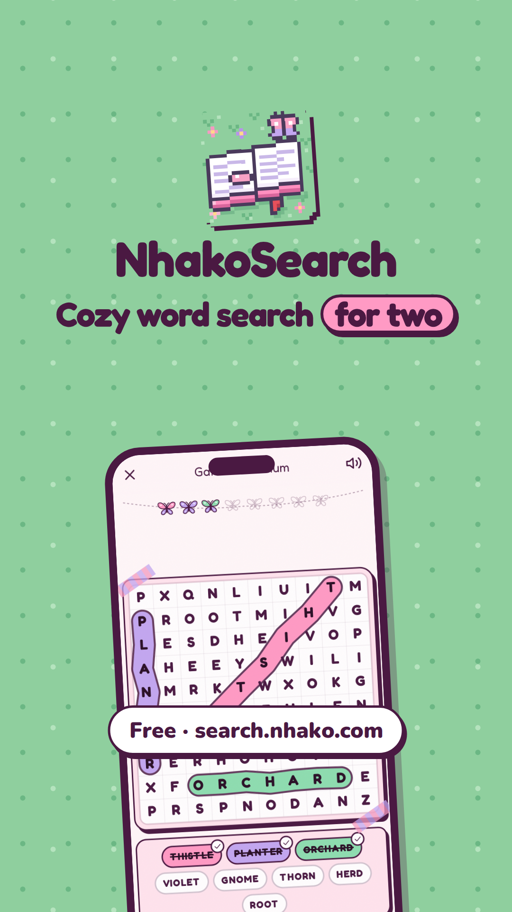
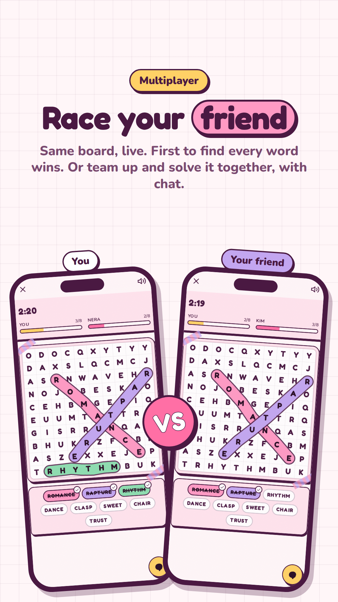
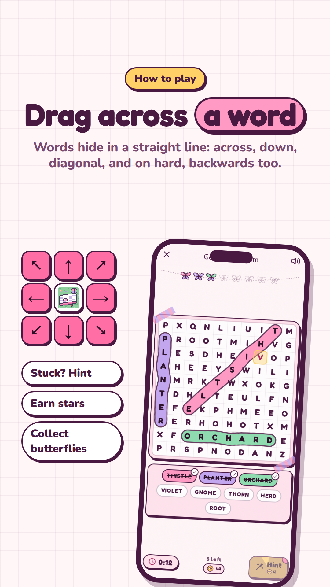
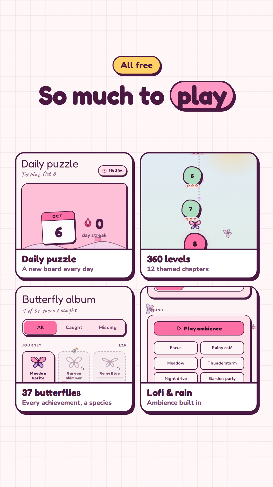
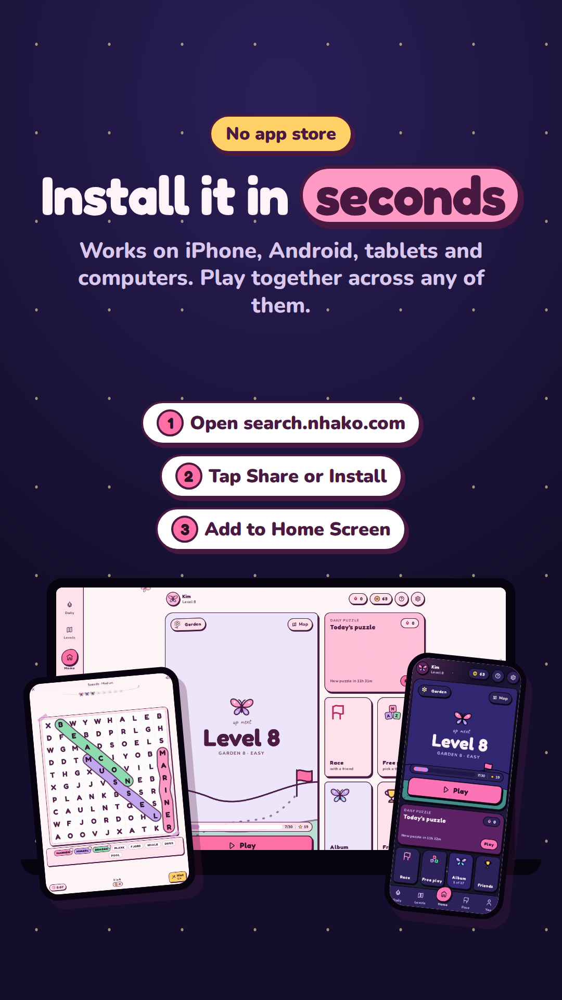

<p align="center">
  
</p>

<h1 align="center">NhakoSearch</h1>

<p align="center"><b>Word search. Made for two.</b></p>

A cozy, hand-drawn word-search game for two. Solo puzzles in twelve themes, a
daily challenge, a 360-level path, a butterfly album of 37 achievements,
friends with a leaderboard, and realtime multiplayer: race your partner, or
solve one board together while you chat.

Play free at **[search.nhako.com](https://search.nhako.com)**: no download,
and it installs to your Home Screen like any app.

---

## Launch

**▶ [Watch the 60-second launch video](launch/nhakosearch-launch.mp4)**
(vertical 1080×1920, made for TikTok, Reels and Shorts). It is cut from the
real app, including a live two-player race and a co-op room.

The launch carousel, five posters in the same format:

<p align="center">
  
  
  
  
  
</p>

**The logo** is a pixel-art open book on a lawn, slanted a little, with one
word circled in a pink capsule like a found word on the board, a ribbon
bookmark, and a butterfly on the raised corner. It is drawn in the same pixel
language as the Nhako Tools icon, from a grid in `scripts/logo-art.mjs`.

How the video and posters are made: [Launch video and posters](#launch-video-and-posters).

---

## Features

- **Free play**: 12 themes (Garden, Rainy Day, Night Sky, Bakery…) × easy /
  medium / hard, with a fresh-word picker so boards don't repeat.
- **Daily puzzle**: one shared board per day, with streaks.
- **Level path**: 360 levels across themed chapters, up to three stars each.
- **Multiplayer**: race a friend on the same board in real time, or solve it
  together in co-op, with in-room chat.
- **Butterfly album**: 37 achievements, each a hand-designed species.
- **Friends**: add by code, live requests, and a friend leaderboard.
- **Butterfly tokens**: earned by playing, spent on hints.
- **Procedural ambience**: rain, storm, wind, birds and four lofi tracks,
  all synthesised in the browser.
- **Light and dark**: "Meadow Journal" by day, "Night Garden" by night.
- **Installable PWA**: works as a Home Screen app on iOS and Android.
- **How to play**: `/how-to-play` explains directions per difficulty, hints,
  tokens, multiplayer and installing, with every number read from the code.
  A new player's first board also shows a ghost finger tracing a real word.
- **Fits every screen**: phones in portrait (down to 360×640) and landscape,
  tablets and desktop. The tab bar becomes a side rail on wide screens and on
  a phone held sideways, and the board grows into the room it has.
- **Never loses a board by accident**: Back (browser button, iOS edge swipe,
  Android back) mid-puzzle or mid-race asks before leaving.

---

## Stack

| Layer | Choice | Notes |
|---|---|---|
| Framework | Next.js 16 (App Router), React 19, TypeScript | |
| Styling | Tailwind CSS v4 | CSS-variable theming, light/dark independent of system |
| Animation | Framer Motion | |
| Backend | Supabase | Postgres + RLS, Google OAuth, Realtime channels, RPCs |
| Audio | Web Audio API | Fully synthesised at runtime: no audio files shipped |
| Testing | Playwright | layout, a11y, navigation, race + chat, audio, rewards, security, performance |
| Hosting | Vercel | |

Everything runs on free tiers.

---

## Getting started

```bash
npm install
cp .env.example .env.local   # fill in your Supabase project values
npm run dev
```

Apply the database schema in the Supabase SQL editor, in order:

1. `supabase_schema.sql`: tables and row-level security for a fresh project
2. `supabase/migrations/002_security.sql` … `006_friend_live.sql`

005 adds token wallets, friendships, friend codes, the friend leaderboard and
the one-call `get_player_summary()` RPC. Without it, signed-in players see no
tokens, no friends page and slower screens. 006 pushes friend requests and
accepts live over a private Realtime topic per player (`user:<id>`), so the
badges and toasts update without a refresh.

| Command | Purpose |
|---|---|
| `npm run dev` | Development server |
| `npm run build` / `npm start` | Production build / serve it |
| `npm run lint` | ESLint |
| `npm run icons` | Redraw the favicon and every PNG icon from `scripts/logo-art.mjs` |
| `npx playwright test` | Full test suite (expects the app on :3002) |

Security headers come from `next.config.ts` and behave differently under
`next dev`. Verify CSP against `npm run build && npm start`.

To reach the dev server from another machine (LAN or Tailscale IP), add the
host to `DEV_ORIGINS` in `.env.local`, e.g. `DEV_ORIGINS=192.168.1.20`.

---

## Project layout

```
app/                     Routes (App Router) + error / not-found / loading
  daily/  level-path/    Daily challenge, level map and level play
  play/standard/         Free play: 12 themes x 3 difficulties
  play/race/             Multiplayer lobby and room (with chat)
  album/  friends/       Butterfly album, friends + leaderboard
  profile/  settings/    You, sound mixer, account
  how-to-play/           The rules, with every number read from the code
  robots.ts  sitemap.ts  SEO, plus opengraph-image.png / twitter-image.png
components/
  game/  multiplayer/  nav/  sound/  ui/
  butterfly/Species.tsx  Draws any butterfly species from its recipe
  rewards/TokenPill.tsx  The token balance HUD
lib/
  auth/session.ts        The signed-in user, read once for the whole app
  data/cache.ts          Stale-while-revalidate cache (persisted)
  data/player.ts         The player summary every lobby screen reads
  rewards/               Tokens, hints economy, achievements, species, journal
  social/friends.ts      Friend codes, requests, leaderboard
  nav/leaveGuard.ts      "Leave this game?" on Back while a board is in progress
  nav/routes.ts          Which routes are gameplay / chromeless
  site.ts                Site URL, description and per-page share metadata
  words/                 Theme word lists, fresh-word picker
  audio/                 Procedural ambience + sound effects
  puzzle/  levels/  daily/  multiplayer/
docs/                    Design spec (design.md) and game-feel notes
  launch/source/         Source of the link-preview image (app/opengraph-image.png)
launch/                  Launch video, TikTok posters and the pipeline that renders them
public/icons/            App icons (any, maskable, apple-touch), written by npm run icons
scripts/                 logo-art.mjs (the pixel logo) + icons.mjs (npm run icons)
supabase/migrations/     SQL migrations
tests/                   Playwright suites
```

---

## How it works

### Data and navigation speed (`lib/data/`)

Every lobby screen (Home, Daily, Levels, You, Album) reads one cached
**player summary**. Signed-in players load it with a single RPC; guests from
localStorage. The cache is stale-while-revalidate and persisted, so a tab
switch paints real numbers on its first frame and refreshes behind it, and a
cold start shows last session's numbers instantly. Tabs also prefetch on
press-in. Writes (finishing a level, spending tokens) patch the cached summary
optimistically and then refetch.

The user comes from `getSession()` (local, no network) via
`lib/auth/session.ts`. Row-level security still checks the token on every
query. Do not reintroduce `auth.getUser()` in read paths: it is a network
round trip and each page used to make four of them.

### Rewards (`lib/rewards/`)

- **Butterfly tokens** are earned by finishing puzzles (more for harder boards,
  more stars, no hints, daily streaks, race wins, achievements) and spent on
  hints. Signed-in balances only move through the `adjust_tokens` RPC, which
  bounds each change and refuses to go negative.
- **Hints** cost 4 tokens. With too few tokens a hint is still available but
  adds time (+20s, +30s, …), and every hint has an 8-second cooldown, so hints
  never become the fast way through. Stars use the time including penalties.
- **The album is the achievement list.** Each of the 37 achievements is a
  species with a hand-picked, unique design (`speciesKey` uniqueness is
  tested). Daily puzzles and co-op clears leave keepsake butterflies whose
  design is derived from their date. Unlocks are stored as `ach-<id>` rows in
  `butterfly_collection`.

### Words (`lib/words/`)

Twelve themes, about 6,000 words. Each word sits in exactly one difficulty
of its theme, by length: easy 3-5 letters, medium 5-7, hard 6-12 (the boards
are 8×8, 10×10 and 13×13).

Free play remembers, per device and per theme+difficulty, the words it has
shown (up to 70% of the pool) and prefers unseen ones, bringing back the
longest-unseen first. Level chapters walk one seeded deck per theme instead
of reshuffling per level, and chapter II continues where chapter I stopped.
A level theme holds at least 140 / 216 / 176 words: what its two chapters
deal (120 / 192 / 160) plus one spare per level, which is where a clashing
word is backfilled from. So no word appears twice along the level path,
which `tests/words.spec.ts` checks board by board.
The daily rotates through all twelve themes; each race round picks its theme
from the shared seed.

### Puzzle generation (`lib/puzzle/generator.ts`)

Deterministic: Mulberry32 seeded from a `cyrb128` hash. Same seed, words and
difficulty give the same grid in every browser. Difficulty: easy 8×8 / 6 words,
medium 10×10 / 8, hard 13×13 / 10.

### Multiplayer (`lib/multiplayer/useRaceRoom.ts`)

Ephemeral Supabase Realtime channels (`room:{code}`); there is no room table.
The leader owns the round (mode, difficulty, countdown, winner, history).
Chat persists for the room session, is rate-limited (6 per 8 s; Realtime
closes channels that send too fast, which would end the race), shows a typing
indicator, and logs room events as system lines.

### Audio (`lib/audio/engine.ts`)

All ambience is synthesised live through one look-ahead scheduler: rain
(stereo wash + droplets + plinks + roof), thunder (crack + rolling rumble +
sub), wind (gusts, whistle, leaves), birds (five species at random distances)
and four generated lofi tracks (swung drums, bass, FM electric piano, melody,
vinyl). A compressor and limiter keep a full mix from clipping. The same
voices render offline (`renderAmbience`), which the audio tests use to check
levels without a speaker.

### Layout and navigation (`app/globals.css`, `lib/nav/`)

Four Tailwind variants describe the screen, not just its width:

| Variant | When | Used for |
|---|---|---|
| `compact:` | portrait, ≤760px tall | Home tightens so all four mode tiles sit above the tab bar |
| `short:` | landscape, ≤500px tall (a phone sideways) | Game screen becomes board left, garland + words + boosters right |
| `wide:` | landscape, ≥640px wide | Word list and boosters beside the board; the board sizes from the height |
| `rail:` | ≥1024px wide, or `short` | The tab bar becomes a notch-aware left rail |

Back during a game: a page arms `useArmLeaveGuard(true)` while there is
something to lose (a word found, a race running). The game bar then keeps a
same-URL history entry on top, so Back pops that instead of the page and opens
the same "Leave this game?" sheet as the close button. Leave goes back past
both entries in one step. A won board disarms it, so one Back leaves.

The ambient butterflies fly behind every page but steer out of any
`[data-no-fly]` element (the board, the word tray). A reading column is marked
`data-no-fly="text"`: the flock keeps to its side margins, and fades out where
there are none (a phone).

### Logo and icons (`scripts/`)

The logo is a frozen pixel grid: one string per row, one letter per pixel,
each letter a key into a small palette (plum outline, never black). `npm run
icons` writes the favicon and every PNG at whole-number multiples of that
grid, encoded with `node:zlib`, so nothing is resampled and every edge stays a
hard pixel edge. The Apple icon is full bleed (iOS rounds it and turns
transparency black); the maskable icons sit on a wider lawn so Android's crop
keeps the whole book. To change the logo, edit the rows and re-run the script.

### SEO and sharing (`lib/site.ts`, `app/`)

`lib/site.ts` holds the site URL and description, and `pageMetadata()` gives
each indexable page its title, canonical URL, Open Graph and Twitter card in
full (Next replaces a parent's `openGraph` rather than merging it, so a page
that set only a title used to lose its share image). `robots.ts` keeps live
race rooms out of crawlers; personal and per-board pages stay crawlable but
are `noindex`. `sitemap.ts` lists the public pages, Home carries JSON-LD, and
the 1200×630 share image is built from `docs/launch/source/og.html`.

---

## Invariants: each was a real bug

1. **`GridBoard` declares both grid axes** (`gridTemplateRows` alongside
   columns). Without rows the grid overflows its card and the highlight drifts
   off the letters.
2. **The board sizes from its width** (`.grid-board`). Never `h-full` +
   `aspect-square` on a board wrapper; it collapsed to 106px on phones.
3. **Realtime broadcast payloads are nested**: read `msg.payload.x`, never
   `msg.x`.
4. **Race state is keyed `me` / `opponent` by user id**, never positionally.
5. **Shuffles are Fisher-Yates**, never `sort(() => random() - 0.5)`: the
   latter differs by browser and desynced races.
6. **CSP and HSTS are production-only.** Verify on a production build.
7. **`allowedDevOrigins`** must list any host used to reach the dev server
   (or set `DEV_ORIGINS`), or the dev app never hydrates.
8. **The `AudioContext` is suspended, never closed.**
9. **`useRaceRoom`'s channel effect deliberately omits deps** so the channel is
   not rebuilt mid-race. Don't "fix" the eslint-disable.
10. **The app builds without Supabase credentials** (placeholder client), and
    the daily rolls over at **UTC+8** (`GAME_DAY_UTC_OFFSET_MINUTES`).
11. **Sibling React keys are unique.** The hint button's wand and its count
    badge once shared `key={hintsUsed}`: every hint left an old wand behind,
    and they piled up across a stretched button that covered the timer.
12. **A hint belongs to its word** (`useGameLogic` keeps cell → word). Its ring
    goes when that word is found; keyed by cell alone, rings stayed on
    finished capsules for the rest of the board.
13. **A `@custom-variant` with a comma media list breaks Tailwind v4**
    ("Invalid empty selector", and the browser keeps stale CSS). Write one
    `@media { @slot; }` block per query, as `rail:` does.
14. **Hit areas grow from inside the border.** An `after:` hit area on a
    `border-2` chip starts 2px in, so a 36px chip needs `after:-inset-y-1.5`
    for 44px, and wrapped rows need a 12px gap so neighbours don't overlap.
15. **Level backfill never borrows another level's word.** A word that clashes
    (one inside another) is replaced from the spare words past the end of the
    path, each level starting at its own spare; taking the next level's words
    put that word on two boards.

---

## Design principles

From `docs/design.md`, "The Meadow Journal": asymmetric radii, solid offset
"sticker" shadows, paper grain, hand-drawn SVG icons (no emoji in UI chrome;
chat content may use them). Dark mode "Night Garden" is designed, not inverted
(`docs/game-feel.md` §5).

---

## Security

- **No secrets in the repo.** The only keys the app uses are
  `NEXT_PUBLIC_SUPABASE_URL` and `NEXT_PUBLIC_SUPABASE_ANON_KEY`, which ship
  in the client bundle by design. Real values live in `.env.local`
  (gitignored); the service-role key is never used by the app.
- **Row-level security on every table.** Players can read and write only
  their own rows. Friendships, wallets and cross-player stats go through
  `SECURITY DEFINER` RPCs with a pinned `search_path` and explicit
  `EXECUTE` grants (`supabase/migrations/005`).
- **Private realtime topics.** Friend notifications use a private
  `user:<id>` channel that only its owner may join (`006`). Race rooms are
  public broadcast channels keyed by a random room code; chat is length-capped,
  rate-limited and stripped of control characters on receipt.
- **Hardened headers** in production: strict CSP, HSTS (preload),
  `frame-ancestors 'none'`, `nosniff` and a locked-down Permissions-Policy.
- **Known limitation:** progress, race results and token earnings are
  reported by the client. RLS stops anyone touching another player's data,
  but a player can inflate their *own* stats. Tokens have no monetary value.

Found a vulnerability? Please report it privately via GitHub's
**Security → Report a vulnerability** on this repository rather than opening
a public issue.

---

## Launch video and posters

`launch/nhakosearch-launch.mp4` (1080×1920, 60 s, for TikTok / Reels /
Shorts) and the five carousel posters in `launch/posters/` are rendered from
the live app:

```bash
npx next dev -p 3003                      # in another terminal
node launch/video/capture.mjs             # app screenshots, incl. a real two-player room
node launch/video/audio.mjs               # the synthesised soundtrack
node launch/video/render.mjs --stills     # spot-check frames in launch/video/out/
node launch/video/render.mjs              # the video
node launch/video/render.mjs --posters    # the posters
```

The current video and posters were captured before the round-2 UI changes,
so they still show the old "Race" tab and Home layout; re-run the steps above
to refresh them.

`launch/video/timeline.mjs` is the one source of timing for picture and
sound. Every frame is drawn by `renderFrame(t)` and screenshotted, so a render
is identical on any machine. The pipeline follows Nhako Tools' launch film.

---

## Contributing

Run `npx playwright test` against a production build before pushing
(`rm -rf .next && npm run build && npm start -- -p 3002`: an incremental build
has served stale CSS before). The suites encode fixes that are easy to
regress: grid geometry, realtime payload handling, chat rate limits, reward
maths, audio levels, Back mid-game, phone and landscape fit, and hints.

## License

No license has been chosen yet, so the code is © kimzam, all rights reserved.
You're welcome to read it and play the game.
